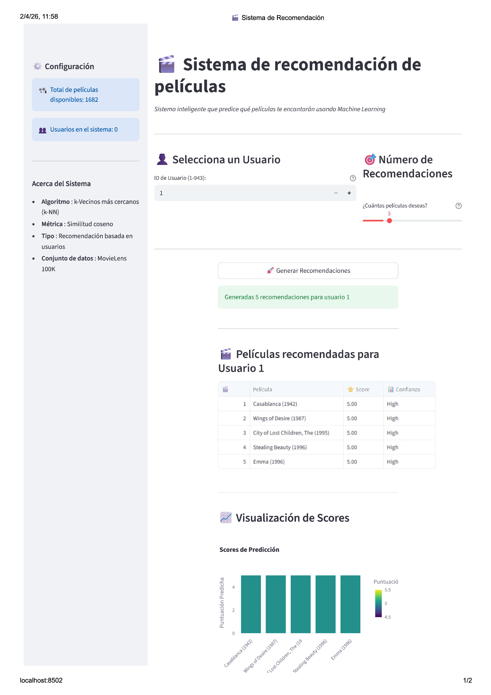

## 🎬 Demo



## 🔌 API


# 🎬 Sistema de Recomendación de Películas con IA

Un sistema completo de recomendación de películas que utiliza Inteligencia Artificial, desarrollado con fines educativos.

## 🌟 **Características**

- ✅ **Modelo de IA** entrenado con datos reales (MovieLens 100K)
- ✅ **API REST** con FastAPI para obtener recomendaciones
- ✅ **Interfaz web visual** con Streamlit
- ✅ **Gestión de experimentos** con MLflow
- ✅ **Documentación educativa** completa
- ✅ **Ejercicios prácticos** para estudiantes

## 🏗️ **Arquitectura del Sistema**

```
📊 Datos (MovieLens 100K)
    ↓
🤖 Modelo k-NN (scikit-learn)
    ↓
📦 MLflow (gestión de modelos)
    ↓
🌐 API REST (FastAPI)
    ↓
💻 Interfaz Web (Streamlit)
```

## 📋 **Requisitos**

- Python 3.10+
- Entorno virtual (recomendado)
- 8GB RAM mínimo
- Conexión a internet (para instalar dependencias)

## 🚀 **Instalación y Uso**

### 1. **Configurar el entorno**
```bash
# Clonar o descargar el proyecto
cd ia-herramientas

# Activar entorno virtual (si existe)
.venv\Scripts\activate

# Instalar dependencias
pip install -r requirements.txt
```

### 2. **Entrenar el modelo**
```bash
python src/ml/train.py
```
**Resultado esperado:**
- ✅ Modelo entrenado y guardado en MLflow
- ✅ Archivos `data/item_cols.npy` y `data/user_cols.npy` generados
- ✅ Métricas: RMSE ~1.40, MAE ~1.05

### 3. **Iniciar la API**
```bash
uvicorn src.api.api_fastapi:app --host 127.0.0.1 --port 8080
```
**URLs importantes:**
- 🏠 Estado de la API: http://localhost:8080/
- 📖 Documentación: http://localhost:8080/docs
- 🎯 Ejemplo de recomendación: http://localhost:8080/recommend/1

### 4. **Iniciar la interfaz web**
```bash
streamlit run streamlit_simple.py --server.port 8502
```
**Interfaz web:** http://localhost:8502

## 📊 **Datos del Sistema**

### **Dataset MovieLens 100K:**
- 👥 **943 usuarios** únicos
- 🎬 **1,682 películas** (ej: Toy Story, GoldenEye, etc.)
- ⭐ **100,000 calificaciones** (escala 1-5)
- 📅 **Período:** Años 90

### **Rendimiento del modelo:**
- 📈 **RMSE:** 1.40 (Error cuadrático medio)
- 📉 **MAE:** 1.05 (Error absoluto medio)
- 🕳️ **Sparsity:** 92.2% (datos faltantes)

## 🎯 **Cómo usar la interfaz**

### **Streamlit Web UI:**
1. **Seleccionar usuario** (ID 1-943)
2. **Elegir número de recomendaciones** (1-10)
3. **Hacer clic en "Generar Recomendaciones"**
4. **Ver resultados** con scores y gráficos

### **API REST (para desarrolladores):**
```bash
# Obtener recomendaciones
curl http://localhost:8080/recommend/1?n_recommendations=5

# Ver usuarios disponibles
curl http://localhost:8080/users

# Estado de la API
curl http://localhost:8080/
```

## 📚 **Material Educativo**

El proyecto incluye material completo para enseñanza:

### **Para instructores:**
- 📖 `GUIA_EDUCATIVA.md` - Explicación teórica completa
- 🎓 `PRESENTACION_CLASE.md` - Plan de clase y demostraciones
- 🧪 `EJERCICIOS_PRACTICOS.md` - Actividades para estudiantes

### **Conceptos cubiertos:**
- ¿Qué es un sistema de recomendación?
- Algoritmos de IA (k-NN, filtrado colaborativo)
- APIs REST y protocolos HTTP
- MLflow para gestión de modelos
- Desarrollo de interfaces web

## 🔧 **Estructura del Proyecto**

```
ia-herramientas/
├── data/                       # 📊 Datos de entrenamiento
│   ├── ratings.csv             # Calificaciones de usuarios
│   ├── ratings.data            # Datos originales
│   ├── movies.item             # Información de películas
│   ├── item_cols.npy           # Mapeo de items (generado)
│   └── user_cols.npy           # Mapeo de usuarios (generado)
├── src/
│   ├── api/
│   │   └── api_fastapi.py      # 🌐 Servidor API REST
│   └── ml/
│       └── train.py            # 🤖 Entrenamiento del modelo
├── mlruns/                     # 📦 Experimentos MLflow
├── streamlit_app.py            # 💻 Interfaz completa
├── streamlit_simple.py         # 💻 Interfaz simplificada
├── test_api.py                 # 🧪 Script de pruebas API
├── test_local.py               # 🧪 Pruebas locales
├── requirements.txt            # 📚 Dependencias
├── GUIA_EDUCATIVA.md          # 📖 Material educativo
├── PRESENTACION_CLASE.md      # 🎓 Guía para instructores
├── EJERCICIOS_PRACTICOS.md    # 🧪 Ejercicios para alumnos
└── README.md                  # 📋 Este archivo
```

## 🧪 **Pruebas y Validación**

### **Prueba rápida del sistema completo:**
```bash
# 1. Entrenar modelo
python src/ml/train.py

# 2. Probar localmente
python test_local.py

# 3. Iniciar API (en terminal separado)
uvicorn src.api.api_fastapi:app --host 127.0.0.1 --port 8080

# 4. Probar API
python test_api.py

# 5. Iniciar interfaz (en otro terminal)
streamlit run streamlit_simple.py --server.port 8502
```

### **Validación de funcionamiento:**
- ✅ Modelo carga sin errores
- ✅ API responde en `/` con código 200
- ✅ Recomendaciones se generan correctamente
- ✅ Interfaz web se conecta a la API
- ✅ Gráficos se muestran correctamente

## 🐛 **Solución de Problemas**

### **Error: "Puerto ya en uso"**
```bash
# Cambiar puerto de la API
uvicorn src.api.api_fastapi:app --port 8081

# Cambiar puerto de Streamlit
streamlit run streamlit_simple.py --server.port 8503
```

### **Error: "Modelo no encontrado"**
```bash
# Re-entrenar el modelo
python src/ml/train.py

# Verificar archivos generados
ls data/*.npy
```

### **Error: "API no disponible"**
```bash
# Verificar que la API esté corriendo
curl http://localhost:8080/

# Revisar logs del servidor
```

### **Error: "Dependencias faltantes"**
```bash
# Reinstalar todas las dependencias
pip install -r requirements.txt --force-reinstall
```

## 🎓 **Uso Educativo**

### **Para clases de IA/ML:**
1. **Demostrar conceptos básicos** con la interfaz visual
2. **Explorar el código** paso a paso
3. **Modificar parámetros** y ver efectos
4. **Realizar ejercicios** prácticos incluidos

### **Ejemplos de preguntas para estudiantes:**
- ¿Por qué el Usuario 1 recibe diferentes recomendaciones que el Usuario 50?
- ¿Qué pasa si cambiamos k=5 a k=10 en el algoritmo?
- ¿Cómo mejorarías el sistema para películas modernas?

### **Extensiones posibles:**
- Añadir más algoritmos (Matrix Factorization, Deep Learning)
- Incorporar información de géneros
- Implementar sistemas híbridos
- Añadir interfaz de administración

## ⚡ **Quick Start**

```bash
# Inicio rápido en 3 comandos:
python src/ml/train.py                              # Entrenar modelo
uvicorn src.api.api_fastapi:app --port 8080 &      # API en background  
streamlit run streamlit_simple.py --server.port 8502  # Interfaz web
```

**¡Listo!** Abre http://localhost:8502 y comienza a explorar! 🚀

---

## Pruebas locales (Docker)

Para comprobar que la API funciona antes de dockerizar, ejecutar en local:

```bash
uvicorn src.api.api_fastapi:app --reload
```

## Despliegue con Docker

Comandos para ejecutar en la terminal del servidor:

1. Construir la imagen de Docker (el "paquete" de la IA):

```bash
docker build -t recomendador-ia:v1 .
```

2. Ejecutar el contenedor (la "instancia" en el servidor):

```bash
docker run -d --name recomendador_prod -p 80:8000 recomendador-ia:v1
```

Notas:
- `-d`: modo detached (en segundo plano).
- `-p 80:8000`: mapea el puerto 80 del host al 8000 del contenedor.
- Ajustar nombres y etiquetas (`recomendador-ia:v1`, `recomendador_prod`) según convenga.
